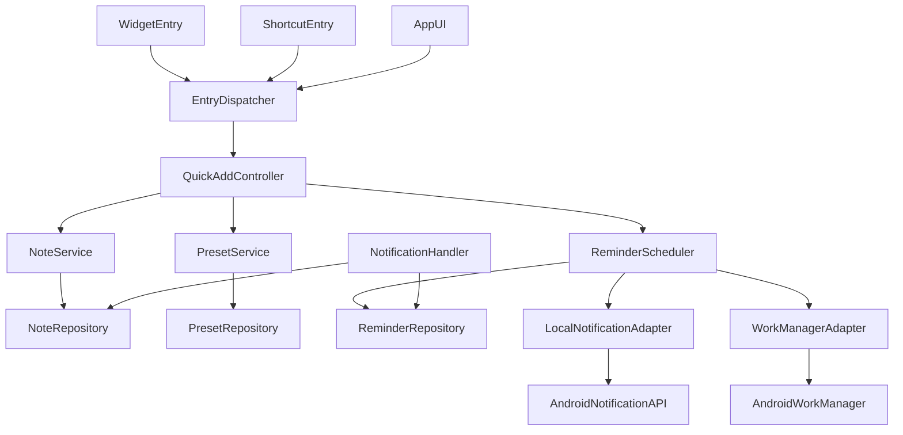
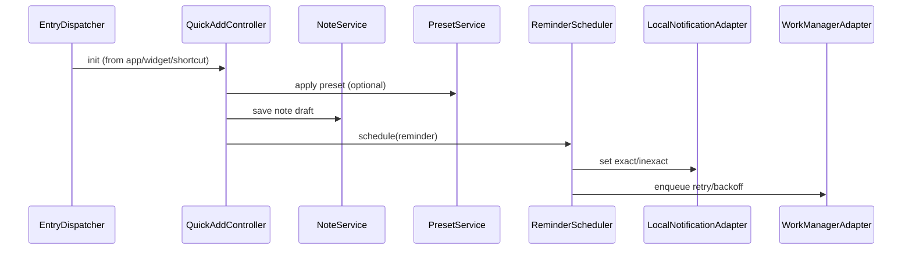

# Design Document

---
**Purpose**: Provide sufficient detail to ensure implementation consistency across different implementers, preventing interpretation drift.

**Approach**:
- Include essential sections that directly inform implementation decisions
- Omit optional sections unless critical to preventing implementation errors
- Match detail level to feature complexity
- Use diagrams and tables over lengthy prose

**Warning**: Approaching 1000 lines indicates excessive feature complexity that may require design simplification.
---

> Requirement IDの表記は `N.M`（例: 1.1）は要件書の各受入条件番号に対応。Requirement 1 の1〜4を1.1〜1.4として扱う（同様に 2.1〜2.4 ... 7.1〜7.4）。

## Overview 
FlickMemo は、円形UIとフリック操作で通知設定を最短化し、メモ入力とリマインド設定を一連の操作で完了させる Flutter(Android) アプリ。ユーザーはテキスト/音声入力やカラー分類を選択し、詳細/簡易モードで時刻・時間帯を直感的に指定できる。オフラインでも動作し、ホームウィジェットやショートカットから即座にメモ作成が可能。

### Goals
- 10秒以内でメモ作成と通知設定を完了できるフローを提供
- 詳細/簡易の円形UIモードを切替可能にし、正確さと速度を両立
- オフラインでもローカル保存と通知キューを維持し、通知抑止時の再提示に対応

### Non-Goals
- クラウド同期やアカウント管理
- 位置情報通知の実装（将来拡張のみ）
- 高度な自然言語解析による入力補完

## Architecture
新規機能かつ単独アプリのため、Clean Architecture（Flutter UI / Domain / Data + Platform Adapters）を採用。UIは Flutter、状態は Riverpod(StateNotifier)で管理し、ドメインサービスがリポジトリとスケジューラを仲介する。通知、ウィジェット、ショートカットなど複数エントリポイントをドメイン経由で一貫管理する。

### Existing Architecture Analysis (if applicable)
現状コードなし。ステアリングに合わせ、パターンや命名は今後の実装で具体化する。

### Architecture Pattern & Boundary Map
**Architecture Integration**
- Selected pattern: Clean Architecture（UI→Domain→Data/Platform の依存方向を内向きに固定）
- Domain/feature boundaries: Note/Reminder/Preset を独立したサービスとし、UIエントリ（画面/ウィジェット/ショートカット/通知タップ）は Application Service を介して共通処理
- Existing patterns preserved: ステアリングの「パターンのみ記載」「列挙回避」に沿って境界定義
- New components rationale: 通知精度確保のため Scheduler、再利用性のため PresetService、エントリ統合のため EntryDispatcher を新設
- Steering compliance: オフライン・ローカル保存を前提とし、依存一覧化を避けたパターン記述のみ



### Technology Stack

| Layer | Choice / Version | Role in Feature | Notes |
|-------|------------------|-----------------|-------|
| Frontend / CLI | Flutter (Dart) + Riverpod(StateNotifier) | メモ入力UI、円形UI、状態管理 | 宣言的UIと単一状態ソース |
| Backend / Services | Dart Domain Services | Note/Reminder/Preset のユースケース | UIとデータの仲介 |
| Data / Storage | Drift (SQLite) | ローカル永続化（オフライン前提） | マイグレーション/型安全 |
| Messaging / Events | flutter_local_notifications (Android exact if permitted), workmanager | 通知スケジュールと再提示 | exact alarm 権限前提のフォールバックを用意 |
| Infrastructure / Runtime | Android (API level 未定) | 通知、ウィジェット、ショートカット、音声入力 | プラグインの対応API確認が必要 |

## System Flows


## Requirements Traceability
| Requirement | Summary | Components | Interfaces | Flows |
|-------------|---------|------------|------------|-------|
| 1.1 | クイック入力画面表示 | QuickAddUI, QuickAddController | NoteService | Init sequence |
| 1.2 | 保存でタイムスタンプ付き永続化 | NoteService, NoteRepository | NoteRepository | Save flow |
| 1.3 | 音声入力反映 | InputModeController, QuickAddController | SpeechRecognizer Adapter | Input handling |
| 1.4 | 未保存終了の確認 | QuickAddUI | UI Dialog | UI flow |
| 2.1 | テキスト入力モード | InputModeController | UI State | UI flow |
| 2.2 | 音声入力モード開始 | InputModeController | SpeechRecognizer Adapter | Input handling |
| 2.3 | カラー属性保持 | NoteService, NoteRepository | NoteRepository | Save flow |
| 2.4 | モード切替で状態保持 | InputModeController, QuickAddController | UI State | UI flow |
| 3.1 | 絶対時刻通知 | ReminderScheduler, ReminderRepository | LocalNotificationAdapter | Schedule flow |
| 3.2 | 相対時間通知 | ReminderScheduler | LocalNotificationAdapter | Schedule flow |
| 3.3 | 未確認通知の再提示（遅延し得る） | ReminderScheduler (MVP: Snooze/Manual, P1: WorkManager) | WorkManagerAdapter | Retry flow |
| 3.4 | 端末不在後の再提示（遅延し得る） | ReminderScheduler (MVP: Snooze/Manual, P1: WorkManager) | WorkManagerAdapter | Retry flow |
| 4.1 | 詳細モード（分単位） | CircularSchedulerUI, InputModeController | UI State | Selection flow |
| 4.2 | 簡易モード（時間帯） | CircularSchedulerUI | UI State | Selection flow |
| 4.3 | モード切替で保持 | CircularSchedulerUI, QuickAddController | UI State | UI flow |
| 4.4 | 選択結果を通知へ反映 | QuickAddController, ReminderScheduler | ReminderScheduler | Save flow |
| 5.1 | プリセット保存 | PresetService, PresetRepository | PresetRepository | Save flow |
| 5.2 | プリセット適用 | PresetService | PresetRepository | Init flow |
| 5.3 | プリセット更新 | PresetService | PresetRepository | Update flow |
| 5.4 | モード切替をプリセットに含む | PresetService | PresetRepository | Init flow |
| 6.1 | ウィジェット起動で即表示 | WidgetEntry, EntryDispatcher | EntryDispatcher | Init flow |
| 6.2 | ショートカット起動でプリセット適用 | ShortcutEntry, EntryDispatcher, PresetService | EntryDispatcher | Init flow |
| 6.3 | ロック時の再開 | EntryDispatcher | OS Lock Handling | Resume flow |
| 6.4 | オフライン時の保存・キュー | EntryDispatcher, QuickAddController, ReminderScheduler | Drift/WorkManager | Save/Schedule |
| 7.1 | Androidかつローカル保存 | NoteRepository, PresetRepository, ReminderRepository | Drift | Persistence |
| 7.2 | オフライン継続利用 | All repositories, ReminderScheduler | Drift/WorkManager | Offline flow |
| 7.3 | 個人情報送信なし | All components | n/a | n/a |
| 7.4 | 10秒以内完了目標 | QuickAddController, ReminderScheduler | n/a | UX flow |

> 3.3/3.4 は段階的に実現する: **MVP** はユーザー操作起点（Snooze/再設定）で再提示、**P1** は WorkManager による自動再提示/再スケジュール。

## Components and Interfaces

### Component Summary
| Component | Domain/Layer | Intent | Req Coverage | Key Dependencies (P0/P1) | Contracts |
|-----------|--------------|--------|--------------|--------------------------|-----------|
| QuickAddUI (Flutter Widget) | UI | クイック入力・確認UI | 1.1,1.4,4.1,4.2 | QuickAddController (P0) | State |
| CircularSchedulerUI | UI | 詳細/簡易の円形選択UI | 4.1,4.2,4.3 | QuickAddController (P0) | State |
| InputModeController | UI State | 文字/音声/カラー切替管理 | 1.3,2.1-2.4 | SpeechRecognizer Adapter (P1) | State |
| QuickAddController (StateNotifier) | UI/Domain | 入力状態・バリデーション・保存トリガ | 1.*,2.*,3.*,4.*,6.4,7.4 | NoteService (P0), ReminderScheduler (P0), PresetService (P1) | Service |
| EntryDispatcher | Application Service | app/ウィジェット/ショートカットの起動集約 | 6.1-6.4 | QuickAddController (P0), PresetService (P1) | Service |
| NoteService | Domain | メモ作成/更新/カラー保持 | 1.2,2.3,6.4,7.1 | NoteRepository (P0) | Service |
| PresetService | Domain | プリセット保存/適用/更新 | 5.1-5.4,6.2 | PresetRepository (P0) | Service |
| ReminderScheduler | Domain | 絶対/相対の通知スケジュールと再提示 | 3.1-3.4,4.4,6.4 | ReminderRepository (P0), LocalNotificationAdapter (P0), WorkManagerAdapter (P1) | Service |
| WidgetEntry | Platform Adapter | ウィジェットのエントリポイント | 6.1,6.4 | EntryDispatcher (P0) | API |
| ShortcutEntry | Platform Adapter | ショートカットのエントリポイント | 6.2,6.4 | EntryDispatcher (P0) | API |
| NotificationHandler | Platform Adapter | 通知タップ/アクションの処理 | 3.3,3.4 | ReminderRepository (P1), NoteRepository (P1) | API |
| NoteRepository | Data | メモ永続化 | 1.2,2.3,6.4,7.1 | Drift (P0) | State |
| PresetRepository | Data | プリセット永続化 | 5.1-5.4,6.2 | Drift (P0) | State |
| ReminderRepository | Data | リマインダー永続化 | 3.*,4.4,6.4,7.1 | Drift (P0) | State |
| LocalNotificationAdapter | Platform Adapter | exact/inexact通知設定 | 3.1,3.2 | flutter_local_notifications (P0) | API |
| WorkManagerAdapter | Platform Adapter | 再提示・バックオフジョブ | 3.3,3.4,6.4 | PlatformWorkManager (P1) | Batch |

### UI / State Layer

#### QuickAddUI (Flutter Widget)
- **Intent**: 最小入力UI、未保存警告、保存トリガ。
- **Requirements**: 1.1,1.4,4.1,4.2,7.4
- **Contracts**: State
- **Responsibilities & Constraints**
  - タイトル必須入力と本文任意入力のフィールドを表示。
  - 未保存離脱時に確認ダイアログを表示。
  - 円形UIコンポーネントを組み込み、選択結果を QuickAddController に通知。
- **Dependencies**
  - Inbound: EntryDispatcher（起動コンテキスト, P1）
  - Outbound: QuickAddController（保存/スケジュール指示, P0）
- **Implementation Notes**
  - Integration: `QuickAddController` の state を Riverpod経由で購読し、Flutter Widgetにバインド。
  - Validation: タイトル空の場合は保存をブロック。
  - Risks: UIブロックを避けるため保存は非同期で実行。

#### CircularSchedulerUI
- **Intent**: 詳細/簡易モードの円形選択UI。
- **Requirements**: 4.1,4.2,4.3
- **Contracts**: State
- **Responsibilities & Constraints**
  - 詳細モード: 分単位で針を回す選択。
  - 簡易モード: 朝/昼/夕/夜の4分割とフリック方向での指定。
  - モード切替時に現在の選択を保持。
- **Dependencies**
  - Outbound: QuickAddController（選択結果送信, P0）
- **Implementation Notes**
  - Integration: Flutter カスタムWidgetとして提供。
  - Validation: 選択結果は標準化されたトリガ型に変換。
  - Risks: ジェスチャー誤検出に備えスナップ動作を用意。

#### InputModeController
- **Intent**: 文字/音声/カラーの入力モード管理。
- **Requirements**: 1.3,2.1,2.2,2.3,2.4
- **Contracts**: State
- **Responsibilities & Constraints**
  - 現在の入力モードとカラー選択を保持。
  - 音声入力開始/停止のコマンドを QuickAddController 経由で発火。
- **Dependencies**
  - Outbound: SpeechRecognizer Adapter（P1）、QuickAddController（P0）
- **Implementation Notes**
  - Integration: 権限未許可時は音声開始をキャンセルしテキスト入力を提示。
  - Validation: モード切替時に既存テキストとカラーを保持。
  - Risks: 音声認識がネットワーク依存である端末でUX低下。

### Domain Layer

#### QuickAddController (StateNotifier)
- **Intent**: 入力状態と保存/スケジュール orchestrator。
- **Requirements**: 1.1-1.4,2.1-2.4,3.1-3.4,4.4,6.4,7.4
- **Contracts**: Service
- **Responsibilities & Constraints**
  - タイトル必須のバリデーション、本文・カラー・モード状態保持。
  - 保存要求時に NoteService と ReminderScheduler を順に実行。
  - プリセット適用結果を状態に反映。
- **Dependencies**
  - Outbound: NoteService (P0), ReminderScheduler (P0), PresetService (P1)
- **Service Interface**
```dart
abstract class QuickAddController {
  Future<SaveResult> saveNoteWithReminder(NoteInput input, ReminderTrigger? trigger);
  NoteInput applyPreset(Preset preset);
}
```
- **Implementation Notes**
  - Integration: 保存とスケジュールは一連で行い、スケジュール失敗時はリトライ指示を返す。
  - Validation: タイトル必須、トリガ未指定時はデフォルトなしでも保存可。
  - Risks: 長時間処理で10秒目標に抵触しないよう、重い処理は非同期。

#### EntryDispatcher
- **Intent**: app/ウィジェット/ショートカットの起動エントリ統合。
- **Requirements**: 6.1-6.4
- **Contracts**: Service
- **Responsibilities & Constraints**
  - 起動元（app/widget/shortcut/notification）に応じた初期パラメータとプリセットの適用。
  - ロック状態時はアンロック後に QuickAdd をリジューム。
- **Dependencies**
  - Outbound: QuickAddController (P0), PresetService (P1)
- **Implementation Notes**
  - Integration: Intent extras を標準化し QuickAddController 初期化に渡す。Entry Input Contract（表）を参照。
  - Validation: 無効なプリセットIDは無視してデフォルトで起動。
  - Risks: エントリ分岐の重複を避け、テスト容易性を確保。

##### Entry Input Contract
| key | type | required | source (entryType別) | default | notes |
|-----|------|----------|----------------------|---------|-------|
| entryType | enum(app/widget/shortcut/notification) | yes | 全て | n/a | エントリ識別 |
| presetId | string | no | shortcut/widget | none | プリセット適用ID |
| openNoteId | string | no | notification | none | 既存ノートを開く |
| defaultTrigger | {type: absolute|relative|bucket, value: epochMillis|minutes|bucket} | no | shortcut/widget | none | bucketは朝/昼/夕/夜定義に従う |
| defaultTrigger.value types | absolute: epochMillis(ms), relative: minutes(int), bucket: enum(朝/昼/夕/夜) | n/a | n/a | n/a | 単位と型を固定 |
| inputMode | enum(text|voice) | no | app/shortcut/widget | text | 入力手段。cardはcolor選択UIとして扱う |
| color | enum | no | app/shortcut/widget | none | 分類用カラー |

#### NoteService
- **Intent**: メモの作成/更新/カラー保持。
- **Requirements**: 1.2,2.3,6.4,7.1
- **Contracts**: Service
- **Responsibilities & Constraints**
  - NoteInput を受け、Note エンティティを生成し Drift に保存。
  - 作成/更新時に createdAt/updatedAt を設定。
- **Dependencies**
  - Outbound: NoteRepository (P0)
- **Service Interface**
```dart
abstract class NoteService {
  Future<NoteId> create(NoteInput note);
}
```
- **Implementation Notes**
  - Integration: DB例外はアプリ内エラーに変換しUIへ通知。
  - Validation: タイトル必須、カラーは定義済みパレットに制限。
  - Risks: 書き込み遅延時のUX低下を避けるため非同期。

#### PresetService
- **Intent**: 通知条件/入力方式/カラーを含むプリセット管理。
- **Requirements**: 5.1-5.4,6.2
- **Contracts**: Service
- **Responsibilities & Constraints**
  - プリセット保存・更新・適用を提供。
  - モード切替や入力方式を含む設定をまとめて返却。
- **Dependencies**
  - Outbound: PresetRepository (P0)
- **Service Interface**
```dart
abstract class PresetService {
  Future<PresetId> save(PresetInput preset);
  Future<void> update(PresetId id, PresetInput preset);
  Future<Preset?> get(PresetId id);
}
```
- **Implementation Notes**
  - Integration: 不整合プリセットはバリデーションで拒否。
  - Validation: 時間帯/オフセット値の範囲チェック。
  - Risks: プリセット数が増えた場合のUXは別途検討。

#### ReminderScheduler
- **Intent**: 絶対/相対の通知スケジュールと再提示を管理。
- **Requirements**: 3.1-3.4,4.4,6.4
- **Contracts**: Service
- **Responsibilities & Constraints**
  - ReminderTrigger（absolute/relative/bucket）を受け、実時刻を計算。
  - Bucket（朝/昼/夕/夜）はデフォルトで 08:00 / 12:00 / 17:00 / 21:00 にマッピングし、選択時刻が過去なら翌日の同Bucketに繰り越す（プリセットで上書き可、繰り越しは翌日同Bucketに固定）。  
    | bucket | time | rollover |
    |--------|------|----------|
    | 朝 | 08:00 | 過去の場合は翌日08:00 |
    | 昼 | 12:00 | 過去の場合は翌日12:00 |
    | 夕 | 17:00 | 過去の場合は翌日17:00 |
    | 夜 | 21:00 | 過去の場合は翌日21:00 |
  - exact許可がある場合は flutter_local_notifications で可能な限り正確に通知し、ない場合は遅延し得る前提で inexact または WorkManager での近似再提示を行う。
  - DND/端末再起動による抑止は「未確認の可能性がある通知を再提示する」前提で扱い、WorkManager による再スケジュールは拡張（P1）。MVPではユーザー操作（Snooze/再設定）起点で再提示。
- **Dependencies**
  - Outbound: ReminderRepository (P0), LocalNotificationAdapter (P0), WorkManagerAdapter (P1)
- **Service Interface**
```dart
sealed class ReminderTrigger {}
class Absolute extends ReminderTrigger { final int epochMillis; Absolute(this.epochMillis); }
class Relative extends ReminderTrigger { final int minutes; Relative(this.minutes); }
class Bucket extends ReminderTrigger { final TimeBucket slot; Bucket(this.slot); }

abstract class ReminderScheduler {
  Future<ScheduleResult> schedule(NoteId noteId, ReminderTrigger? trigger);
}
```
- **Implementation Notes**
  - Integration: バックオフや再スケジュールは WorkManager に委譲（P1）。MVPではスヌーズ操作や手動再設定を優先。
  - Validation: 過去時刻の場合は最近接の再提示タイミングへ調整。
  - Risks: exact許可が無い端末で精度が下がること、DND時は遅延し得ることをUXで周知。

### Platform Adapters

#### WidgetEntry / ShortcutEntry
- **Intent**: 各エントリポイントから QuickAdd を起動。
- **Requirements**: 6.1,6.2,6.4
- **Contracts**: API
- **Responsibilities & Constraints**
  - AppWidgetProvider / ShortcutManager からの Intent を受け取り EntryDispatcher に委譲。
  - ロック時は再開処理へリダイレクト。
- **Implementation Notes**
  - Validation: 無効なプリセットIDをガード。
  - Risks: ホームプロセス殺害による状態喪失はリジュームで対応。

#### NotificationHandler
- **Intent**: 通知タップのハンドリング。
- **Requirements**: 3.3,3.4
- **Contracts**: API
- **Responsibilities & Constraints**
  - 通知タップでアプリ復帰とノート表示（閲覧/編集）。
  - 再提示ロジックは ReminderScheduler/WorkManagerAdapter に委譲（ここでは持たない）。
- **Implementation Notes**
  - Risks: 権限不足で通知チャンネルが無効の場合のエラーハンドリング。

#### LocalNotificationAdapter / WorkManagerAdapter
- **Intent**: 通知スケジュールと再提示の実行（Flutterプラグイン経由）。
- **Requirements**: 3.1-3.4
- **Contracts**: API / Batch
- **Implementation Notes**
  - LocalNotificationAdapter: flutter_local_notifications でチャンネル/権限/ピンポイント通知を管理。
  - WorkManagerAdapter: workmanager プラグインで再提示・バックオフジョブを登録。

### Data Layer

#### NoteRepository / PresetRepository / ReminderRepository
- **Intent**: Driftベースの永続化。
- **Requirements**: 1.2,2.3,3.*,5.*,6.4,7.1
- **Contracts**: State
- **Responsibilities & Constraints**
  - スキーマは Note/Preset/Reminder を分離し、外部キーで関連付け。
  - トランザクションは Note+Reminder の同時保存をサポート。
- **Implementation Notes**
  - インデックス: reminderのscheduledAtに索引を付与。
  - Migration: 将来の同期拡張に備え、versioned schema を採用。

## Data Models

### Domain Model
- **Entities**:
  - `Note`: id, title, body?, color, createdAt, updatedAt
  - `Reminder`: id, noteId, triggerType (absolute/relative/bucket), scheduledAt, status
  - `Preset`: id, name, triggerTemplate (absolute?relative?bucket), inputMode, color
- **Invariants**: Note.title必須、ReminderはNoteに従属、Presetは名前一意（任意スコープ）。

### Logical Data Model
- `notes`(id PK, title TEXT, body TEXT?, color TEXT, created_at, updated_at)
- `reminders`(id PK, note_id FK→notes, trigger_type TEXT, scheduled_at INTEGER, status TEXT)
- `presets`(id PK, name TEXT UNIQUE, trigger_type TEXT, trigger_value TEXT, input_mode TEXT, color TEXT)
- 整合性: note削除時のreminder/preset参照は要件に合わせてCASCADEまたは論理削除を選択（デフォルトはCASCADE）。

## Error Handling
- **権限エラー**: マイク権限拒否時は音声入力を停止しテキスト入力を促す。exact alarm未許可時は遅延し得る前提で近似スケジュール+再提示（P1）にフォールバック。
- **スケジュール失敗**: LocalNotificationAdapter での登録失敗時は WorkManager による再スケジュールを登録するのは拡張（P1）。MVPではスヌーズ/再設定を促し、UIへリトライ可能なステータスを返す。
- **データ永続化エラー**: Drift例外はユーザー向けエラー（保存失敗）とし、ログで詳細を残す。

## Testing Strategy
- **Unit Tests**
  - ReminderScheduler: absolute/relative/bucket の時刻計算とexact権限の分岐 (3.1-3.4)
  - PresetService: 保存/更新/適用とバリデーション (5.1-5.4)
  - NoteService: タイトル必須とカラー保持 (1.2,2.3)
- **Integration Tests**
  - QuickAddController + NoteService + ReminderScheduler: 保存〜スケジュール連携 (1.*,3.*,4.4)
  - EntryDispatcher + PresetService: ショートカット起動でのプリセット適用 (6.2,5.2)
  - LocalNotificationAdapter + WorkManagerAdapter: DND/再起動想定の再提示パス (3.3,3.4)
- **E2E/UI Tests**
  - ウィジェットからのクイック作成と通知受信 (6.1,3.1)
  - 円形UIで簡易/詳細切替→保存→通知 (4.*,3.1)
  - 音声入力でメモ作成→通知表示 (1.3,3.1)
- **Performance/Load**
  - 10秒完了目標: 保存+スケジュール処理の計測。低電力モードでの遅延測定 (7.4)

### Security Considerations
- 個人情報はローカル保存のみ（7.3）。外部送信なし。
- 通知チャンネルは端末ロック状態での表示設定に留意し、内容の露出を最小化（サマリのみ）。

### Performance & Scalability
- exact alarm 未許可時の遅延リスクをUIで周知し、WorkManagerのバックオフを短周期に設定。
- DBインデックスでリマインダー検索を高速化。データ量は端末ローカルで限定的。

### Migration Strategy
- Drift schema versioningを前提に、将来のクラウド同期追加時にフィールド拡張・同期テーブル追加で対応。

## Supporting References (Optional)
- 詳細API仕様やベンダー固有設定は `research.md` を参照。
